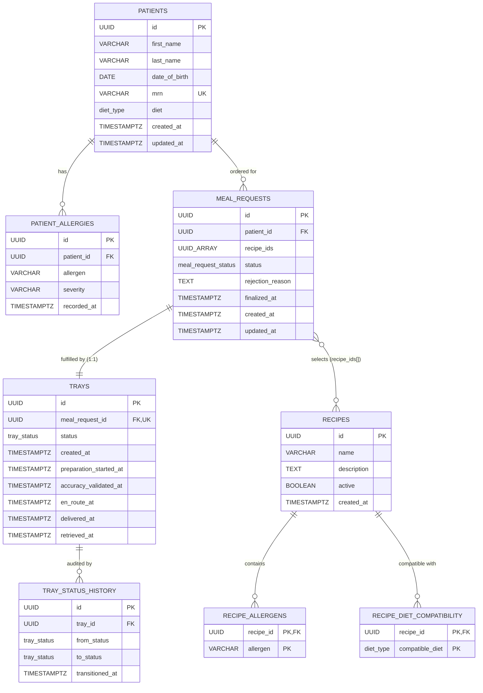
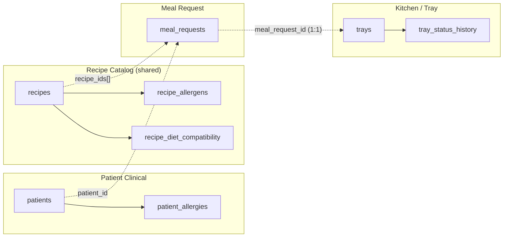
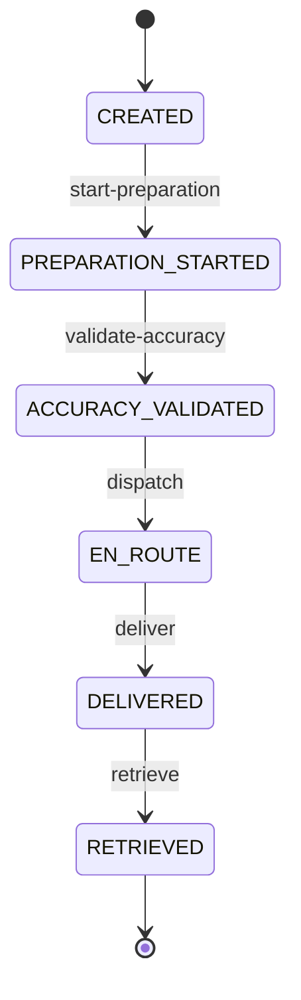
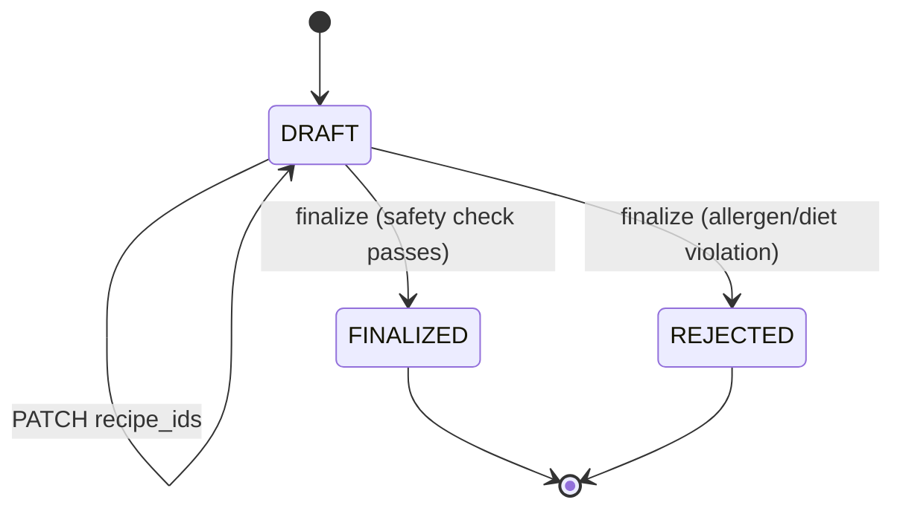

# Database Schema

UML / ER diagram for the schema defined in [`database.sql`](./database.sql). Rendered with Mermaid (GitHub renders this natively).

## Entity-Relationship Diagram

## Bounded Contexts

Dotted arrows are **cross-context references**. In the application layer (Django models) these are stored as plain `UUIDField` rather than `ForeignKey` — see [ARCHITECTURE.md](./ARCHITECTURE.md#module-boundary-rules). The `database.sql` reference schema uses explicit FKs for documentation clarity.

## Enums

| Type | Values |
| ---- | ------ |
| `diet_type` | `REGULAR`, `LOW_SODIUM`, `DIABETIC`, `LOW_FAT`, `PUREED`, `CLEAR_LIQUID`, `FULL_LIQUID` |
| `meal_request_status` | `DRAFT`, `FINALIZED`, `REJECTED` |
| `tray_status` | `CREATED`, `PREPARATION_STARTED`, `ACCURACY_VALIDATED`, `EN_ROUTE`, `DELIVERED`, `RETRIEVED` |

## Tray Lifecycle

Linear, no skipping, no reversals. Invalid transitions return `409 Conflict`.

## Meal Request Lifecycle

On `FINALIZED`, a `trays` row is created in the same transaction (1:1 via `trays.meal_request_id UNIQUE`).
